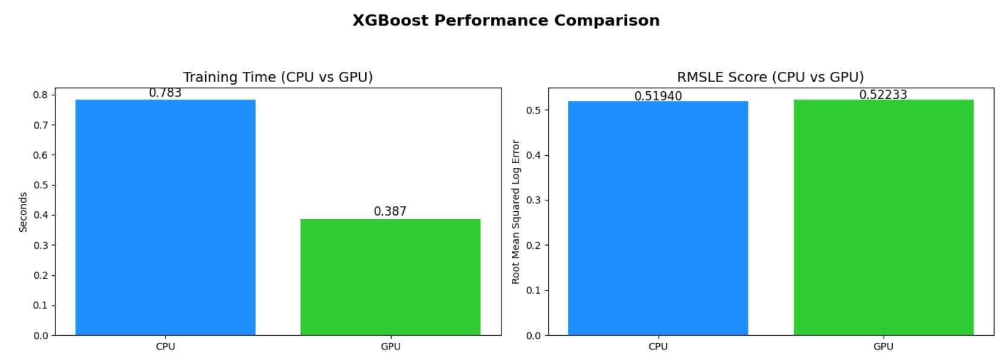

# Comparative Optimization of XGBoost –  NYC Taxi Trip Duration (CPU vs GPU)

Welcome to the **XGBoost CPU vs GPU Benchmark Project**, where we explore how hardware acceleration impacts machine learning training time and performance. Using the **NYC Taxi Trip Duration** dataset, we train XGBoost models on CPU and GPU separately, containerize the experiment using Docker, and compare efficiency and accuracy side by side.

---

###  Live Benchmark Results

| Mode | Training Time (s) | RMSLE   |
|------|-------------------|---------|
| CPU  | 0.783             | 0.5194  |
| GPU  | 0.387             | 0.5223  |

>  GPU model was nearly **2x faster**
>  RMSLE performance was **statistically comparable**
>  Experiment run on 200K samples using `XGBRegressor`

---

##  Project Overview

This project includes:

*  Preprocessing of real-world geospatial trip data  
*  Log-transform target for RMSLE stability  
*  Side-by-side CPU and GPU benchmarking with `XGBoost`  
*  Fully Dockerized environment  
*  Final visual comparison of time vs performance  

---

##  Stack & Tools Used

| Component         | Tool / Framework          |
|------------------|---------------------------|
| ML Framework     | XGBoost                   |
| Preprocessing     | Pandas, NumPy            |
| Evaluation       | RMSLE via Scikit-learn    |
| Visualization    | Matplotlib                |
| Containerization | Docker + Python 3.11      |
| Notebook Runner  | Jupyter (via Docker)      |

---

##  Docker-Based Execution

###  Build Docker Image
```bash
docker build -t xgboost-benchmark .
```

###  Run Notebook via Docker
```bash
docker run -p 8888:8888 xgboost-benchmark
```

Then open your browser and visit:  
[http://localhost:8888](http://localhost:8888)  
Paste the token shown in terminal to access the notebook.

---

##  File Structure

```bash
xgboost-cpu-vs-gpu/
├── xgboost-cpu-vs-gpu.ipynb     # Notebook with CPU vs GPU comparison
├── Dockerfile                   # Environment definition
├── requirements.txt             # Python packages
├── .gitignore                   # Excludes large files like .csv
└── README.md                    # You're reading it!
```

---

##  Visual Performance Summary

>  RMSLE is consistent across hardware  
>  Training time is drastically lower on GPU



---

## Bonus Opportunity Completed

This project meets the **bonus requirement** for containerization:

- Dockerized
- Reproducible 
- GitHub-ready
- CSVs excluded with `.gitignore`

---

## Author

**Anirudh Krishna**  
MS in Applied Machine Learning, University of Maryland  
[GitHub Profile](https://github.com/Anirudh20602)

---

## Future Improvements

*  Add GPU memory profiling
*  Scale dataset from 200K → 1M+ rows
*  Use MLflow for run tracking and metrics logging
